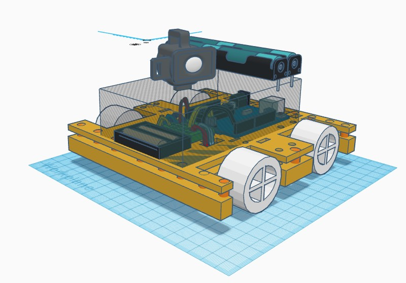
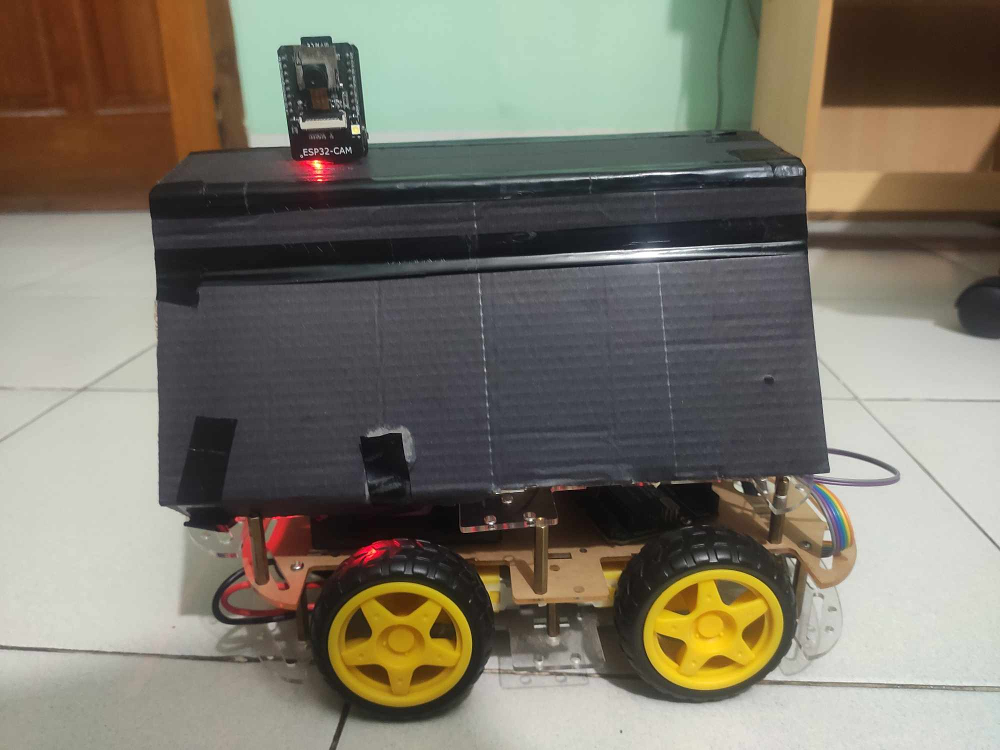

# iot-crop-disease-detection

Project website built using Google Sites : https://sites.google.com/view/voltagevandals/home

# Update

v1 - Camera is able to detect black color and give a warning. Python code is given, OpenCV has been used.

v0 - Robot or Car has been designed and assembled. Arduino code to control has been uploaded.

# 3D Design of Proposed Prototype

# Prototype

